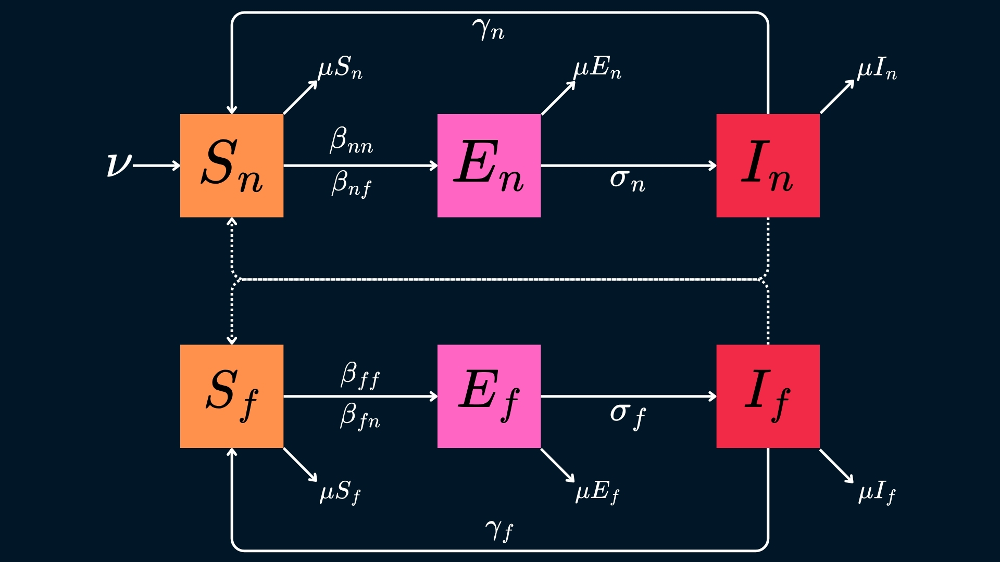
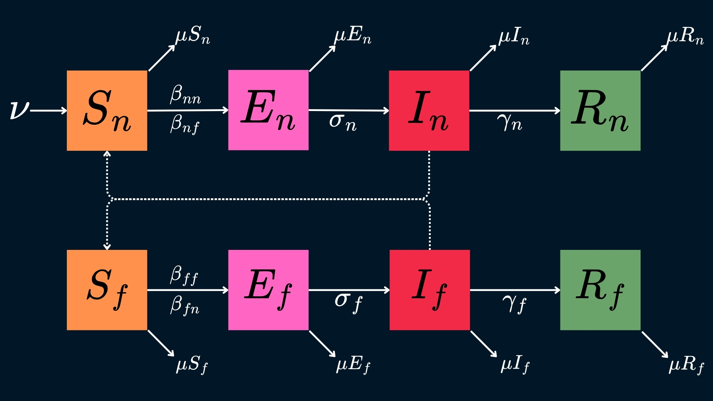
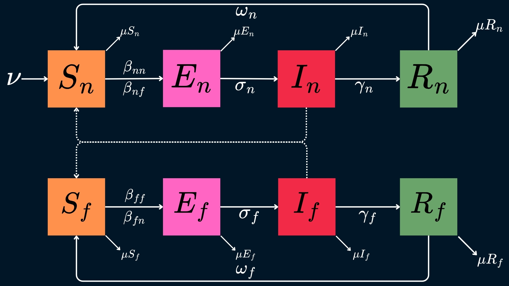
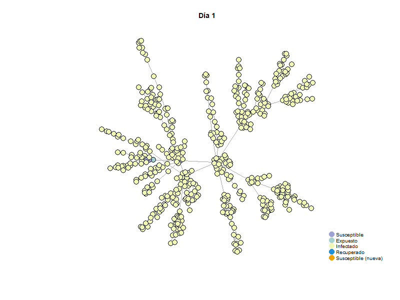

```{=html}
<style type="text/css">
  body{
    font-family: Times New Roman;
  font-size: 12pt;
  
}
</style>
```


```{r setup, include=FALSE}
knitr::opts_chunk$set(echo = TRUE)
```

# Introducción

Las enfermedades respiratorias afectan a los pulmones y las vías respiratorias. Este tipo de infecciones pueden ser causadas por una gran variedad de patógenos, tales como bacterias, virus y/u hongos (CDC, 2024). Estas enfermedades se consideran como un problema de salud a nivel mundial, debido a su alta morbilidad y mortalidad, según la Organización Mundial de la Salud, cada año mueren cerca de 4 millones de personas a causa de enfermedades respiratorias crónicas (CDC, 2024; OMS, s.f).

Las enfermedades respiratorias transmisibles son aquellas, que como su nombre lo menciona, pueden transmitirse de una persona a otra. Este tipo de enfermedades se caracterizan por tener una gran capacidad de propagación, especialmente en condiciones en las que hay una gran densidad poblacional ya que se transmiten principalmente a través de gotas que surgen de personas infectadas cuando tosen, estornudan o hablan (Department of Health, 2023; CDC, 2024).

Este tipo de enfermedades no solo impactan negativamente en la salud de miles de personas al rederdor del mundo, sino que también están involucrados en un impacto económico y social a nivel mundial (Hadian & Rezayatmand, 2022). Este impacto se ha logrado observar a lo largo de los años por pandemias como la de la Influenza y el COVID-19.

Existen una gran variedad de factores que pueden influir en la propagación de estas enfermedades y el impacto que pueden tener en un individuo, entre ellos es posible destacar algunos factores biológicos como la edad y su estado de salud, sin embargo, también se puede mencionar que los hábitos, como la alimentación y la condición fisica, del individuo juegan un papel crucial en la transmisión y la gravedad de estas enfermedades (Coronel et al, 2018).

El tabaquismo es uno de los hábitos más comunes entre personas jóvenes y adultas, y este se considera como uno de los factores de riesgo más importantes en cuanto a la transmisión de enfermedades, ya que el humo del tabaco esta compuesto por más de 7,000 sustancias químicas, en su mayoría tóxicas y cancerigenas, las cuales afectan principalmente al epitelio de las vías respiratorias, debilitando las defensas contra cualquier patógeno externo y aumentando la vulnerabilidad a infecciones graves (Frino et al., 2024; American Cancer Society, 2020; Véliz et al., 2021).

El gran impacto que tienen las enfermedades respiratorias a nivel mundial, nos resalta la necesidad de contar con herramientas que nos permitan entender mejor la transmisión de estas enfermedades, de tal manera que podemos planificar estrategias efectivas para disminuir su impacto en la población.

## ¡Bienvenido a **InfectoR!** 

Una herramienta diseñada para ayudarte a simular la transmisión de enfermedades respiratorias a través de modelos SEIR, SEIS y SEIRS considerando la presencia de dos poblaciones: individuos fumadores y no fumadores.

### ¿Por qué modelar enfermedades infecciosas?

Modelar enfermedades infecciosas transmisibles es baste importante en el ambito de la epidemiología, ya que nos permite entender y predecir la propagación de distintas enfermedades dentro de una población. Este tipo de herramientas pueden ayudar a diseñar estrategias eficaces de control y prevención que puedan reducir el impacto de estas infecciones.

### ¿Por qué incluir a dos poblaciones distintas?

Los modelos de enfermedades nos permiten explorar diversos factores de riesgo que afectan la transmisibilidad de las infecciones. Al modelar enfermedades respiratorias transmisibles, podemos identificar grupos más vulnerables debido a características de salud, edad o hábitos, como el tabaquismo.

El tabaquismo es un factor que deteriora la salud respiratoria y aumenta la susceptibilidad a enfermedades respiratorias. Además, puede alterar la dinámica de transmisión y complicar el curso de la enfermedad en la población.

### ¿Cuál es la diferencia entre los distintos modelos?

Esta herramienta nos permite realizar modelos SEIR, SEIS y SEIRS. Quizas te preguntes ¿cuál es la diferencia entre cada uno? A continuación te lo explicamos.

Un modelo **SEIS** hace referencia a aquellos en los que tenemos una población inicial que no ha sido expuesta a la enfermedad, por lo que se consideran como **susceptibles.** Estos individuos se vuelven **expuestos** al estar en contacto con el patógeno, sin embargo aún no se encuentran infectados por lo que tampoco pueden transmitir la enfermedad. Posteriormente, los individuos que ya estuvieron expuestos pasan a un estado de **infección**, en el que se vuelven capaces de transmitir la enfermedad. Finalmente, los individuos infectados no desarrollan una inmunidad, por lo que se consideran nuevamente **susceptibles** y podrían enfermarse nuevamente.

En un modelo **SEIR** los individuos logran desarrollar una inmunidad ante la enfermedad, por lo que logran pasar a un estado de **recuperación** sin volverse susceptibles nuevamente.

Un modelo **SEIRS** involucra un estado de r**ecuperación** que provee inmunidad temporal a los individuos, ya que eventualmente pueden volver a un estado de **susceptibilidad** en el que se pueden enfermar nuevamente.

Algunas de las enfermedades que incluye InfectoR pueden modelarse con utilizando más de uno de estos modelos, te sugerimos que consideres los puntos que más te interesan evaluar para que logres escoger el modelo que mejor se adapte a ellos.

Recuerda que puedes utilizar esta herramienta tantas veces como quieras, asi que no tengas miedo de jugar con ella para observar la manera en la que se comportan las enfermedades con los distintos modelos.

# Modelo SEIS

## Parámetros y Ecuaciones

- $S_n$: Susceptibles no fumadores.

- $E_n$: Expuestos no fumadores.

- $I_n$: Infectados no fumadores.

- $S_f$: Susceptibles fumadores.

- $E_f$: Expuestos fumadores.

- $I_f$: Infectados fumadores.

- $\nu$: Tasa de nacimiento o migración.

- $\beta_{nn}$: Tasa de transmisión específica (no fumadores - no fumadores).

- $\beta_{nf}$: Tasa de transmisión específica (no fumadores - fumadores).

- $\beta_{fn}$: Tasa de transmisión específica (fumadores - no fumadores).

- $\beta_{nf}$: Tasa de transmisión específica (fumadores - fumadores).

- $\gamma_n$: Tasa de recuperación asociada a los no fumadores.

- $\gamma_f$: Tasa de recuperación asociada a los fumadores.

- $\mu$: Tasa de muerte específica para cada grupo.

- $\sigma_n$: Tasa de progresión de la infección/presentación de síntomas asociada a los no fumadores.

- $\sigma_f$: Tasa de progresión de la infección/presentación de síntomas asociada a los fumadores.


## Ecuaciones para Grupo de No Fumadores

$$\dot S_n = \nu-\beta_{nn}S_nI_n-\beta_{nf}S_nI_f+\gamma_n I_n-\mu S_n$$

$$\dot E_n = \beta_{nn}S_nI_n+\beta_{nf}S_nI_f-\sigma_n E_n-\mu E_n$$

$$\dot I_n = \sigma_n E_n-\gamma_n I_n - \mu I_n$$


## Ecuaciones para Grupo de Fumadores

$$\dot S_f = -\beta_{ff}S_fI_f-\beta_{fn}S_fI_n-\gamma_f I_f-\mu S_f$$

$$\dot E_n = \beta_{ff}S_fI_f+\beta_{fn}S_fI_n-\sigma_f E_f-\mu E_f$$

$$\dot I_f = \sigma_f E_f-\gamma_f I_f - \mu I_f$$


## Modelo por compartimentos



## Modelo SEIS en deSolve

```{r}
# Cargar la librería deSolve
library(deSolve)

# Definir los parámetros
parametros <- c(
  nu = 0.75, beta_nn = 0.03, beta_nf = 0.08, gamma_n = 0.02, mu_n = 0.75,
  beta_ff = 0.1, beta_fn = 0.09, gamma_f = 0.02, mu_f = 0.8,
  sigma_n = 0.02, sigma_f = 0.1
)

# Definir las condiciones iniciales
inicial <- c(
  Sn = 150, En = 50, In = 50,
  Sf = 150, Ef = 50, If = 50
)

# Escribir el sistema de ecuaciones
SEIS <- function(t, state, parameters) {
  with(as.list(c(state, parameters)), {
    # Ecuaciones para no fumadores
    dSn <- nu - beta_nn * Sn * In - beta_nf * Sn * If + gamma_n * In - mu_n * Sn
    dEn <- beta_nn * Sn * In + beta_nf * Sn * If - sigma_n * En - mu_n * En
    dIn <- sigma_n * En - gamma_n * In - mu_n * In

    # Ecuaciones para fumadores
    dSf <- -beta_ff * Sf * If - beta_fn * Sf * In - gamma_f * If - mu_f * Sf
    dEf <- beta_ff * Sf * If + beta_fn * Sf * In - sigma_f * Ef - mu_f * Ef
    dIf <- sigma_f * Ef - gamma_f * If - mu_f * If

    # Retornar derivadas
    list(c(dSn, dEn, dIn, dSf, dEf, dIf))
  })
}

# Determinar el tiempo a observar
times <- seq(0, 50, by = 0.01)  
out <- ode(y = inicial, times = times, func = SEIS, parms = parametros)

# Convertir a un data frame para graficar
out <- as.data.frame(out)

# Graficar los resultados
library(ggplot2)

# Graficar cada variable
ggplot(out, aes(x = time)) +
  geom_line(aes(y = Sn, color = "Susceptibles no Fumadores")) +
  geom_line(aes(y = En, color = "Expuestos no Fumadores")) +
  geom_line(aes(y = In, color = "Infectados no Fumadores")) +
  geom_line(aes(y = Sf, color = "Susceptibles Fumadores")) +
  geom_line(aes(y = Ef, color = "Expuestos Fumadores")) +
  geom_line(aes(y = If, color = "Infectados fumadores")) +
  labs(
    title = "Modelo SEIS",
    x = "Tiempo",
    y = "Población",
    color = "Variables"
  ) +
  theme_minimal()
```


# Modelo SEIR

## Parámetros y Ecuaciones

- $S_n$: Susceptibles no fumadores.

- $E_n$: Expuestos no fumadores.

- $I_n$: Infectados no fumadores.

- $R_n$: Recuperados no fumadores.

- $S_f$: Susceptibles fumadores.

- $E_f$: Expuestos fumadores.

- $I_f$: Infectados fumadores.

- $R_f$: Recuperados fumadores.

- $\nu$: Tasa de nacimiento o migración.

- $\beta_{nn}$: Tasa de transmisión específica (no fumadores - no fumadores).

- $\beta_{nf}$: Tasa de transmisión específica (no fumadores - fumadores).

- $\beta_{fn}$: Tasa de transmisión específica (fumadores - no fumadores).

- $\beta_{nf}$: Tasa de transmisión específica (fumadores - fumadores).

- $\gamma_n$: Tasa de recuperación asociada a los no fumadores.

- $\gamma_f$: Tasa de recuperación asociada a los fumadores.

- $\mu$: Tasa de muerte específica para cada grupo.

- $\sigma_n$: Tasa de progresión de la infección/presentación de síntomas asociada a los no fumadores.

- $\sigma_f$: Tasa de progresión de la infección/presentación de síntomas asociada a los fumadores.


## Ecuaciones para Grupo de No Fumadores

$$\dot S_n = \nu-\beta_{nn}S_nI_n-\beta_{nf}S_nI_f-\mu S_n$$

$$\dot E_n = \beta_{nn}S_nI_n+\beta_{nf}S_nI_f-\sigma_n E_n-\mu E_n$$

$$\dot I_n = \sigma_n E_n-\gamma_n I_n - \mu I_n$$

$$\dot R_n = \gamma_n I_n - \mu R_n$$


## Ecuaciones para Grupo de Fumadores

$$\dot S_f = -\beta_{ff}S_fI_f-\beta_{fn}S_fI_n-\mu S_f$$

$$\dot E_f = \beta_{ff}S_fI_f+\beta_{fn}S_fI_n-\sigma_f E_f-\mu E_f$$

$$\dot I_f = \sigma_f E_f-\gamma_f I_f - \mu I_f$$

$$\dot R_f = \gamma_f I_f - \mu R_f$$


## Modelo por compartimentos



## Modelo SEIR en deSolve

```{r}
# Cargar la librería deSolve
library(deSolve)

# Definir los parámetros
parametros2 <- c(
  nu = 0.5, beta_nn = 0.02, beta_nf = 0.15, gamma_n = 0.5, mu_n = 0.01,
  beta_ff = 0.3, beta_fn = 0.01, gamma_f = 0.07, mu_f = 0.1,
  sigma_n = 0.2, sigma_f = 0.6
)

# Definir las condiciones iniciales
inicial2 <- c(
  Sn = 200, En = 25, In = 10, Rn = 15,
  Sf = 250, Ef = 25, If = 25, Rf = 0
)

# Escribir el sistema de ecuaciones
SEIR <- function(t, state, parameters) {
  with(as.list(c(state, parameters)), {
    # Ecuaciones para no fumadores
    dSn <- nu - beta_nn * Sn * In - beta_nf * Sn * If - mu_n * Sn
    dEn <- beta_nn * Sn * In + beta_nf * Sn * If - sigma_n * En - mu_n * En
    dIn <- sigma_n * En - gamma_n * In - mu_n * In
    dRn <- gamma_n * In - mu_n * Rn

    # Ecuaciones para fumadores
    dSf <- -beta_ff * Sf * If - beta_fn * Sf * In - mu_f * Sf
    dEf <- beta_ff * Sf * If + beta_fn * Sf * In - sigma_f * Ef - mu_f * Ef
    dIf <- sigma_f * Ef - gamma_f * If - mu_f * If
    dRf <- gamma_f * If - mu_f * Rf

    # Retornar derivadas
    list(c(dSn, dEn, dIn, dRn, dSf, dEf, dIf, dRf))
  })
}

# Determinar el tiempo a observar
times <- seq(0, 1000, by = 0.01)  # Intervalo de tiempo
out <- ode(y = inicial2, times = times, func = SEIR, parms = parametros2)

# Convertir a un data frame para graficar
out <- as.data.frame(out)

# Graficar los resultados
library(ggplot2)

# Graficar cada variable
ggplot(out, aes(x = time)) +
  geom_line(aes(y = Sn, color = "Susceptibles no Fumadores")) +
  geom_line(aes(y = En, color = "Expuestos no Fumadores")) +
  geom_line(aes(y = In, color = "Infectados no Fumadores")) +
  geom_line(aes(y = Rn, color = "Recuperados no Fumadores")) +
  geom_line(aes(y = Sf, color = "Susceptibles Fumadores")) +
  geom_line(aes(y = Ef, color = "Expuestos Fumadores")) +
  geom_line(aes(y = If, color = "Infectados Fumadores")) +
  geom_line(aes(y = Rf, color = "Recuperados Fumadores")) +
  labs(
    title = "Modelo SEIR",
    x = "Tiempo",
    y = "Población",
    color = "Variables"
  ) +
  theme_minimal()
```


# Modelo SEIRS

## Parámetros y Ecuaciones

- $S_n$: Susceptibles no fumadores.

- $E_n$: Expuestos no fumadores.

- $I_n$: Infectados no fumadores.

- $R_n$: Recuperados no fumadores.

- $S_f$: Susceptibles fumadores.

- $E_f$: Expuestos fumadores.

- $I_f$: Infectados fumadores.

- $R_f$: Recuperados fumadores.

- $\nu$: Tasa de nacimiento o migración.

- $\beta_{nn}$: Tasa de transmisión específica (no fumadores - no fumadores).

- $\beta_{nf}$: Tasa de transmisión específica (no fumadores - fumadores).

- $\beta_{nf}$: Tasa de transmisión específica (fumadores - no fumadores).

- $\beta_{fn}$: Tasa de transmisión específica (fumadores - fumadores).

- $\gamma_n$: Tasa de recuperación asociada a los no fumadores.

- $\gamma_f$: Tasa de recuperación asociada a los fumadores.

- $\mu$: Tasa de muerte específica para cada grupo.

- $\sigma_n$: Tasa de progresión de la infección/presentación de síntomas asociada a los no fumadores.

- $\sigma_f$: Tasa de progresión de la infección/presentación de síntomas asociada a los fumadores.

- $\omega_n$: Tasa de pérdida de inmunidad asociada a los no fumadores.

- $\omega_f$: Tasa de pérdida de inmunidad asociada a los fumadores. 


## Ecuaciones para Grupo de No Fumadores

$$\dot S_n = \nu-\beta_{nn}S_nI_n-\beta_{nf}S_nI_f-\mu S_n+\omega_nR_n$$

$$\dot E_n = \beta_{nn}S_nI_n+\beta_{nf}S_nI_f-\sigma_n E_n-\mu E_n$$

$$\dot I_n = \sigma_n E_n-\gamma_n I_n - \mu I_n$$

$$\dot R_n = \gamma_n I_n - \mu R_n-\omega_nR_n$$


## Ecuaciones para Grupo de Fumadores

$$\dot S_f = -\beta_{ff}S_fI_f-\beta_{fn}S_fI_n-\mu S_f+\omega_fR_f$$

$$\dot E_f = \beta_{ff}S_fI_f+\beta_{fn}S_fI_n-\sigma_f E_f-\mu E_f$$

$$\dot I_f = \sigma_f E_f-\gamma_f I_f - \mu I_f$$

$$\dot R_f = \gamma_f I_f - \mu R_f-\omega_fR_f$$


## Modelo por compartimentos



## Modelo SEIRS en deSolve

```{r}
# Cargar la librería
library(deSolve)

# Definir los parámetros
parametros3 <- c(
  nu = 0.35, beta_nn = 0.01, beta_nf = 0.15, gamma_n = 0.05, mu_n = 0.01, omega_n = 0.5,
  beta_ff = 0.3, beta_fn = 0.018, gamma_f = 0.07, mu_f = 0.02, omega_f = 0.3,
  sigma_n = 0.04, sigma_f = 0.1
)

# Definir las condiciones iniciales
inicial3 <- c(
  Sn = 200, En = 50, In = 25, Rn = 25,
  Sf = 100, Ef = 75, If = 100, Rf = 25
)

# Definir el sistema de ecuaciones
SEIRS <- function(t, state, parameters) {
  with(as.list(c(state, parameters)), {
    # Ecuaciones para no fumadores
    dSn <- nu - beta_nn * Sn * In - beta_nf * Sn * If - mu_n * Sn + omega_n * Rn
    dEn <- beta_nn * Sn * In + beta_nf * Sn * If - sigma_n * En - mu_n * En
    dIn <- sigma_n * En - gamma_n * In - mu_n * In
    dRn <- gamma_n * In - mu_n * Rn - omega_n * Rn

    # Ecuaciones para fumadores
    dSf <- -beta_ff * Sf * If - beta_fn * Sf * In - mu_f * Sf + omega_f * Rf
    dEf <- beta_ff * Sf * If + beta_fn * Sf * In - sigma_f * Ef - mu_f * Ef
    dIf <- sigma_f * Ef - gamma_f * If - mu_f * If
    dRf <- gamma_f * If - mu_f * Rf - omega_f * Rf

    # Retornar derivadas
    list(c(dSn, dEn, dIn, dRn, dSf, dEf, dIf, dRf))
  })
}

# Determinar el tiempo a observar
times <- seq(0, 200, by = 0.1)  # Intervalo de tiempo
out <- ode(y = inicial3, times = times, func = SEIRS, parms = parametros3)

# Convertir a un data frame para graficar
out <- as.data.frame(out)

# Graficar los resultados
library(ggplot2)

# Graficar cada variable
ggplot(out, aes(x = time)) +
  geom_line(aes(y = Sn, color = "Susceptibles no Fumadores")) +
  geom_line(aes(y = En, color = "Expuestos no Fumadores")) +
  geom_line(aes(y = In, color = "Infectados no Fumadores")) +
  geom_line(aes(y = Rn, color = "Recuperados no Fumadores")) +
  geom_line(aes(y = Sf, color = "Susceptibles Fumadores")) +
  geom_line(aes(y = Ef, color = "Expuestos Fumadores")) +
  geom_line(aes(y = If, color = "Infectados Fumadores")) +
  geom_line(aes(y = Rf, color = "Recuperados Fumadores")) +
  labs(
    title = "Modelo SEIRS",
    x = "Tiempo",
    y = "Población",
    color = "Variables"
  ) +
  theme_minimal()
```

# GIF para Modelo SEIRS

```{r}
# Librerías necesarias
library(igraph)
library(animation)

# Crear red inicial
Red_Inicial <- barabasi.game(500, directed = FALSE)

# Función de simulación y animación
Red_Infecciosa_Animada <- function(x, StateConfig, StateDays, StartNode, R0, Colors, Days, output_file) {
  if (length(StateConfig) != length(StateDays)) stop("StateConfig y StateDays deben tener la misma longitud.")
  
  # Inicialización de la red
  Red_Modificada <- x
  V(Red_Modificada)$State <- StateConfig[1]  # Todos empiezan como susceptibles
  V(Red_Modificada)$Days <- 0  # Días en el estado actual
  
  # Configuración inicial del nodo de inicio
  V(Red_Modificada)$State[StartNode] <- StateConfig[3]  # Infectado
  V(Red_Modificada)$Days[StartNode] <- 1
  
  # Adyacencias de la red
  AdjNet <- as_adj_list(Red_Modificada)
  
  # Layout fijo para las gráficas
  Fija <- layout_nicely(Red_Modificada)
  
  # Crear el GIF
  saveGIF({
    for (d in 1:Days) {
      # Actualizar estados
      for (i in 1:vcount(Red_Modificada)) {
        if (V(Red_Modificada)$Days[i] > 0) {
          # Incrementar días en el estado actual
          V(Red_Modificada)$Days[i] <- V(Red_Modificada)$Days[i] + 1
          
          # Transiciones de estados
          current_state <- V(Red_Modificada)$State[i]
          state_index <- match(current_state, StateConfig)
          if (!is.na(state_index) && V(Red_Modificada)$Days[i] > StateDays[state_index]) {
            next_state <- ifelse(state_index == length(StateConfig), StateConfig[1], StateConfig[state_index + 1])
            V(Red_Modificada)$State[i] <- next_state
            V(Red_Modificada)$Days[i] <- 0  # Reiniciar días
          }
        }
      }
      
      # Propagar infección
      for (i in 1:vcount(Red_Modificada)) {
        if (V(Red_Modificada)$State[i] == StateConfig[3]) {  # Infectado
          # Ajustar el número de vecinos a los disponibles
          new_infected <- sample(as.numeric(AdjNet[[i]]), min(R0, length(AdjNet[[i]])), replace = FALSE)
          for (j in new_infected) {
            if (V(Red_Modificada)$State[j] == StateConfig[1]) {  # Susceptible
              V(Red_Modificada)$State[j] <- StateConfig[2]  # Expuesto
              V(Red_Modificada)$Days[j] <- 1
            }
          }
        }
      }
      
      # Colores para la gráfica
      Col <- Colors[as.numeric(as.factor(V(Red_Modificada)$State))]
      
      # Graficar la red
      plot(Red_Modificada, layout = Fija, vertex.color = Col, vertex.size = 5,
           vertex.label = "", main = paste("Día", d))
      
      # Agregar leyenda con etiquetas y colores
      legend("bottomright", legend = c("Susceptible", "Expuesto", "Infectado", "Recuperado", "Susceptible (nueva)"), 
             col = Colors, pch = 19, pt.cex = 2, cex = 0.8, bty = "n")
    }
  }, movie.name = output_file, interval = 0.5, ani.width = 800, ani.height = 600)
}

# Configuración del modelo SEIRS
StateConfig <- c("S", "E", "I", "R", "S")  # Susceptible, Expuesto, Infectado, Recuperado, Susceptible
StateDays <- c(2, 3, 5, 2, 0)  # Días en cada estado
Colors <- c("#9EA1D4", "#A8D1D1", "#F1F7B5", "#1F91DC", "#F0A202")  # Colores para los estados
StartNode <- 5  # Nodo inicial infectado
R0 <- 3  # Tasa de reproducción
Days <- 50  # Número de días a simular

# Generar GIF
output_file <- "SEIRS_simulation.gif"
Red_Infecciosa_Animada(Red_Inicial, StateConfig, StateDays, StartNode, R0, Colors, Days, output_file)
```



# Conclusiones

El uso de bibliografía es una herramienta útil al momento de plantear modelos 
matemáticos, en todos los modelos planteados en este proyecto, se toma como 
pilar principal, el impacto que tienen condiciones externas a la propia enfermedad
para su contagio y propagación, tal es el caso de que, las pesonas que entren 
en la casilla de los fumadores, tiene un mayor aporte a la fuerza de contagio de 
la enfermedad, además de que la tasa de recuperación es también más baja. 

Plantear modelos basados en divisiones de grupos y con parámetros distintos, o en
general, añadir las variables que sean necesarias para poder representar de la forma
más adecuada o "fiel" a la realidad es importante para que estos tengan una relevancia
epidemiológica y sean así, analíticamente significativos y/o relevantes.


# Bibliografía

Acerca de las enfermedades respiratorias (2024). CDC. Sitio web: https://espanol.cdc.gov/respiratory-viruses/about/index.html
Global Alliance against Chronic Respiratory Disease. www.who.int/gard/news_events/1-3. GARD-06-07-K1.pdf.

Véliz, T., Ponce, D., Mendoza, K., & Valero, N. (2021). Epidemiología de las infecciones respiratorias y sus factores predisponentes en adultos del cantón Jipijapa. Revista de Ciencias, 7(4), 892-914. https://doi.org/10.23857/dc.v7i4.2137

Riesgos para la salud debido al tabaquismo (2020). American Cancer Society. Sitio web: https://www.cancer.org/es/cancer/prevencion-del-riesgo/tabaco/riesgos-para-la-salud-debido-al-tabaquismo/fumar-tabaco.html 

Frino, A., Sellares, J. & Mondon, S. (2024) ¿Cómo afecta el tabaco a las infecciones respiratorias?. Clinic Barcelona. Sitio web: https://www.clinicbarcelona.org/noticias/como-afecta-el-tabaco-a-las-infecciones-respiratorias

Hadian SA, Rezayatmand R. Economic impact of acute respiratory disease pandemics: A scoping review. J Res Med Sci. 2022 Dec 23;27:88. doi: 10.4103/jrms.jrms_870_21. PMID: 36685026; PMCID: PMC9854936.

Coronel, C., Huerta, Y. & Ramos, O. (2018). Factores de riesgo de la infección respiratoria aguda en menores de cinco años. Revista Archivo Médico de Camagüey, 22(2), 194-203.